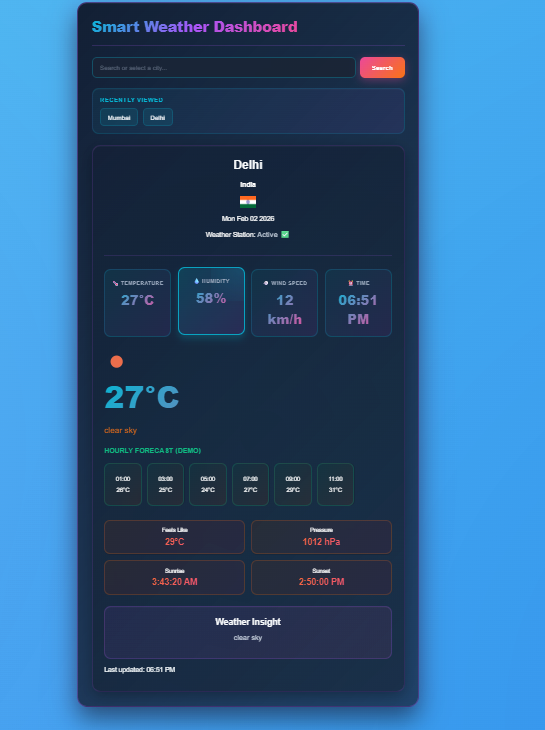

# 🌤️ Smart Weather Dashboard

A modern, responsive, and visually rich weather dashboard built using **HTML, CSS, and JavaScript**.

## 🚀 Features
- City search with auto suggestions
- Demo mode (works without API key)
- Live weather data using OpenWeatherMap API
- Dynamic background based on weather conditions
- Recently searched cities
- Glassmorphism inspired UI
- Hourly forecast uses mock data in demo mode.

## 🖼️ Preview


## 🔧 Tech Stack
- HTML5
- CSS3 (Glassmorphism UI)
- JavaScript (ES6)
- OpenWeatherMap API

## 🔑 API Setup (Optional)
This project works in **demo mode by default**, so it is safe to clone and run without any API key.

To enable live weather data:
1. Create a free account at https://openweathermap.org
2. Generate an API key
3. Open `script.js`
4. Replace:
```js
const API_KEY = "YOUR_API_KEY_HERE";

